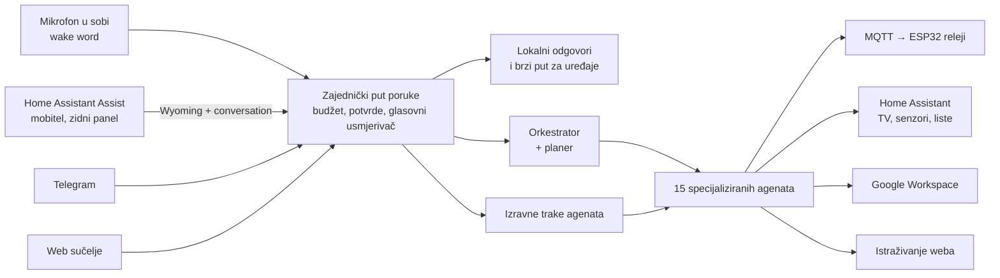

# Jarvis — pametni kućni asistent koji govori hrvatski

> 🇬🇧 [English version](README.md)

Jarvis vodi pravu kuću s jednog Raspberry Pi 5 računala. S njim se razgovara na
više načina:

- preko mikrofona u sobi;
- kroz Home Assistant na mobitelu ili zidnom panelu;
- na Telegramu;
- u pregledniku.

Posvuda odgovara na hrvatskom, istim glasom. Iza svih kanala stoji jedan
višeagentski sustav na Googleovu Agent Development Kitu. Rasuđuje Claude, a
alati dosežu svjetla, utičnice, televizor, senzore klime, Gmail, Google
Kalendar, Drive i web.

U svakodnevnoj je upotrebi od proljeća 2026. Ovaj repozitorij je snimka točno
onoga što radi na Piju.

---

## Što radi

| Kažeš | Što se dogodi |
|-------|---------------|
| *„Ugasi svjetlo u kuhinji"* | Izvrši se bez ijednog poziva modelu. Naredba je gotova tek kad ESP32 potvrdi novo stanje. |
| *„Koja je danas bila najviša vanjska temperatura?"* | Agent `smart_home` čita dugoročnu statistiku Home Assistanta preko WebSocketa: *„29,6 °C (najniža 15,2, prosjek 20,2)"*. |
| *„Otvori A1 Xplore i stavi HRT 1"* | Aplikacija se pokrene preko male Android TV pomoćne aplikacije napisane za to. Jarvis pričeka da aplikacija počne primati tipke pa utipka broj kanala. |
| *„Sutra u 7 upali TV i pusti neku pjesmu"* | Posao se zapiše, a servis za raspored ga u 7:00 izvrši u vlastitoj sesiji. |
| *„Istraži dizalice topline do 12 kW, napravi dokument i pošalji ga Ani"* | Planer to rastavi na korake: istraživanje → izvještaj → Google dokument → traženje kontakta → mail. Mail na adresu na koju kuća nikad nije pisala čeka tvoje „da". |
| *„Tko je bio Nikola Tesla?"* | Brzi agent bez alata odgovori za 2,5 s. Zahtjeve kojima trebaju alati prosljeđuje dalje. |
| *„Ima li grešaka u Home Assistantu i što se događalo dok me nije bilo?"* | Pročita log i logbook samog Home Assistanta, samo za čitanje, i sažme ih u lokalnom vremenu. |
| Fotografija računa na Telegramu | Podaci se izvuku Gemini vizijom i sažmu u odgovoru. |

---

## Kako je složeno



Dva Raspberry Pija:
- **Home Assistant Pi** vrti Home Assistant i drži uređaje.
- **Jarvis Pi** vrti Jarvisa kao pet systemd servisa: web API, petlju za wake
  word, Telegram bota, raspored poslova i Wyoming server koji Home Assistantu
  daje Jarvisovo uho i glas.

→ [Arhitektura](docs/hr/arhitektura.md)

---

## Inženjerski naglasci

- **Prepoznavanje govora izabrano mjerenjem.** Pet mehanizama uspoređeno je na
  hrvatskom govoru snimljenom na Piju. Pobijedio je Gemini Transcribe: 13,1 %
  WER prema 18,9 % za Google Chirp 2. Izbjegao je i Chirpove semantičke pogreške
  („vojna" umjesto „vanjska"). OpenAI je odbijen jer piše ekavicom, a xAI jer je
  hrvatski prepisao kao češki. → [Glasovni put](docs/hr/glasovni-put.md)
- **Zaštite koje ne ovise o dobroj volji modela.** Radnje s posljedicama kod ih
  drži do korisnikove sljedeće poruke. Odobrenje pokriva točno tu radnju:
  primatelje, tekst, sadržaj privitka i dijeljene dokumente. Naredba uređaju
  vrijedi kao izvršena tek kad stigne stvarna potvrda stanja; zadržana MQTT
  poruka nije dokaz. → [Arhitektura: sigurnost](docs/hr/arhitektura.md#sigurnost-i-pouzdanost)
- **Trošak kao ulazni podatak dizajna.** Usmjerivač vrijeme i prognozu odgovara
  bez modela. Mala pitanja šalje agentu od ~1.500 tokena umjesto orkestratoru od
  ~7.000, a promptove sprema u predmemoriju na dvije točke. Svaki poziv se broji
  po agentu, uz dnevni limit potrošnje. → [Modeli i trošak](docs/hr/modeli-i-trosak.md)
- **Home Assistant prilagođen kući.** Vlastita integracija za razgovor pamti
  razgovor i kad se prozor ponovno otvori. Assistov prekid od 0,7 s tišine
  produljuje sigurno i povratno. Odgovori koji nadžive ekran mobitela stižu kao
  obavijest. → [Home Assistant](docs/hr/home-assistant.md)
- **Hardver do pina ADC-a.** ESP32 čvor čita pet BME280 senzora kroz
  multiplekser, SPS30 i potrošnju cijele kuće. Potrošnju računa vlastita C++
  ESPHome komponenta, kalibrirana prema brojilu. → [Hardver](docs/hr/hardver.md)
- **Bilješke o incidentima.** Primjeri: bot mrtav dva dana dok je systemd javljao
  „running", tri dana „U redu" za odspojenu pločicu s relejima, istraživačko
  pitanje od 6,28 $. → [Inženjerske bilješke](docs/hr/inzenjerske-biljeske.md)

---

## Tehnologije

| Područje | Tehnologija |
|----------|-------------|
| Agenti | Google ADK 1.31, LiteLLM, Claude Sonnet 5, Gemini 2.5 (Vertex AI RAG) |
| Glas | openWakeWord, Gemini Transcribe, Google Chirp 2, OpenAI `gpt-4o-mini-tts`, Wyoming protokol |
| Backend | Python 3.11, FastAPI, APScheduler, python-telegram-bot, Firestore |
| Pametna kuća | Home Assistant (REST + WebSocket), MQTT (Mosquitto, paho), ESPHome, vlastita HA integracija |
| Uređaji | Raspberry Pi 5 ×2, WM8960 audio HAT, ESP32 ×2, BME280, SPS30, ADS1115, SCT-013, ZMPT101B, Google TV |
| Sučelje | JS moduli za dashboard (nebo, potrošnja), Chromium kiosk na Waylandu |
| Android | minimalna Android TV aplikacija, izgrađena s `javac`, D8 i `apksigner` |
| Pogon | systemd s watchdogom, Tailscale, GitHub Actions |

---

## Struktura repozitorija

```
agents/                  upute agenata i ADK tvornice agenata
interfaces/              zajednički put poruke; web, Telegram, wake word, raspored
services/                glasovni usmjerivač, brzi put, vrata potvrde, MQTT, Wyoming, STT
tools/                   alati agenata: Google Workspace, Home Assistant, MQTT, istraživanje
web/                     FastAPI aplikacija i web sučelje
scripts/                 ulazne točke servisa, probe, unos korpusa, backup
deploy/rpi/              systemd jedinice, skripte za postavljanje i zvuk, zidni panel
deploy/home_assistant/   vlastita integracija, generator dashboarda, teme, JS moduli
deploy/tv_app_launcher/  pomoćna Android TV aplikacija
esphome/                 ESP32 senzorski čvor i komponenta za mjerenje snage
docs/                    dokumentacija na engleskom i hrvatskom
tests/unit/              1.486 testova
```

---

## Pokretanje

Unit testovi ne trebaju ni vjerodajnice ni mrežu:

```bash
python -m venv .venv && . .venv/bin/activate
pip install -r requirements.txt -r requirements-dev.txt
pytest tests/unit -q
```

Za sam asistent treba hardver i računi opisani u
[Postavljanju](docs/hr/postavljanje.md): Raspberry Pi s audio HAT-om, Home
Assistant, Google Cloud i Workspace vjerodajnice te API ključevi za Anthropic i
OpenAI. Sve postavke su u [`.env.example`](.env.example).

### Provjera ove snimke (2026-09-13)

- Prolazi 1.486 unit testova (4 preskočena na Windowsu jer su samo za Unix).
- Alati samo za čitanje iz Home Assistanta isprobani su na živom Home
  Assistantu (205 entiteta, 10 prostorija): pregled po sobama, povijest
  uređaja, logbook, statistika potrošnje, log i zdravlje sustava odgovorili su
  iz stvarnih podataka.
- Snimka je pokrenuta na produkcijskom Piju pokraj živih servisa, na zasebnim
  portovima:
  - Svih pet ulaznih točaka se pokreće. Web API učitava 15 agenata.
  - Odgovori: vrijeme za 0,1 s, opće pitanje za 2,5 s, današnji vanjski maksimum
    iz povijesti senzora za 6,9 s.
  - Puni Wyoming krug vratio je vlastitu sintetiziranu rečenicu riječ po riječ.

---

## Dokumentacija

| | Hrvatski | English |
|---|---|---|
| Arhitektura | [arhitektura](docs/hr/arhitektura.md) | [architecture](docs/en/architecture.md) |
| Glasovni put | [glasovni-put](docs/hr/glasovni-put.md) | [voice-pipeline](docs/en/voice-pipeline.md) |
| Home Assistant | [home-assistant](docs/hr/home-assistant.md) | [home-assistant](docs/en/home-assistant.md) |
| Hardver | [hardver](docs/hr/hardver.md) | [hardware](docs/en/hardware.md) |
| Postavljanje | [postavljanje](docs/hr/postavljanje.md) | [deployment](docs/en/deployment.md) |
| Modeli i trošak | [modeli-i-trosak](docs/hr/modeli-i-trosak.md) | [llm-and-cost](docs/en/llm-and-cost.md) |
| Inženjerske bilješke | [inzenjerske-biljeske](docs/hr/inzenjerske-biljeske.md) | [engineering-notes](docs/en/engineering-notes.md) |
