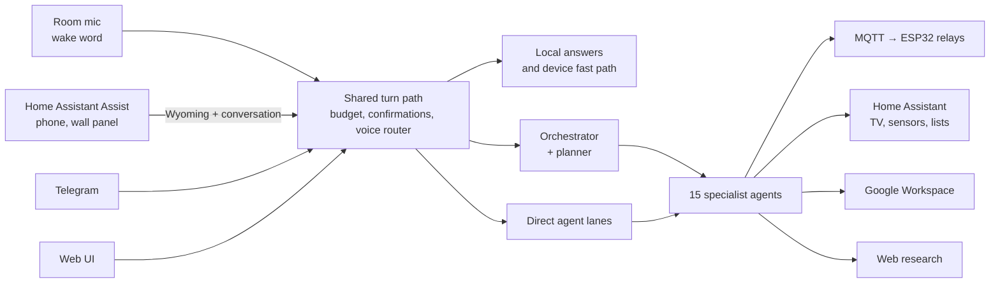

# Jarvis — a Croatian-speaking smart home assistant

> 🇭🇷 [Hrvatska verzija](README.hr.md)

Jarvis runs a real house from a Raspberry Pi 5. You can talk to it through a
microphone in the room, through Home Assistant on a phone or a wall panel, on
Telegram or in a browser — and it answers in Croatian with the same voice
everywhere. Behind every channel is one multi-agent system built on Google's
Agent Development Kit, with Claude doing the reasoning and tools that reach
lights, sockets, the TV, climate sensors, Gmail, Google Calendar, Drive and the
web.

It has been in daily use since spring 2026. This repository is a snapshot of
exactly what runs on the Pi.

---

## What it does

Examples below are real requests, translated.

| You say | What happens |
|---------|--------------|
| *"Ugasi svjetlo u kuhinji"* — turn off the kitchen light | Executed without any model call. The command counts as done only when the ESP32 confirms the new state. |
| *"Koja je danas bila najviša vanjska temperatura?"* — what was today's outdoor high? | The `smart_home` agent reads Home Assistant's long-term statistics over WebSocket: *"29.6 °C (low 15.2, average 20.2)"*. |
| *"Otvori A1 Xplore i stavi HRT 1"* — open the TV app and switch to HRT 1 | Launches the app through a small Android TV helper app written for this, waits until the app accepts keys, and types the channel number. |
| *"Sutra u 7 upali TV i pusti neku pjesmu"* — tomorrow at 7, turn on the TV and play a song | Written to the job store. The scheduler service runs it at 7:00 in its own session. |
| *"Istraži dizalice topline do 12 kW, napravi dokument i pošalji ga Ani"* — research heat pumps, write it up, mail it to Ana | A planner splits this into research → report → Google Doc → contact lookup → email. Mail to an address the house has never used waits for your "da". |
| *"Tko je bio Nikola Tesla?"* — who was Nikola Tesla? | A fast, tool-free agent answers in 2.5 s. Requests that need tools are escalated. |
| A photo of a receipt on Telegram | Extracted with Gemini vision and summarised back. |

---

## How it fits together



Two Raspberry Pis: one runs Home Assistant and owns the devices, the other runs
Jarvis as five systemd services — web API, wake-word loop, Telegram bot,
scheduler, and a Wyoming server that gives Home Assistant Jarvis's ears and
voice. → [Architecture](docs/en/architecture.md)

---

## Engineering highlights

- **Speech recognition chosen by measurement.** Five engines were compared on
  Croatian recorded on the Pi. Gemini Transcribe won: 13.1 % WER against
  18.9 % for Google Chirp 2. It also avoided Chirp's semantic errors ("vojna"
  instead of "vanjska"). OpenAI was rejected for writing ekavian Croatian, and
  xAI for transcribing Croatian as Czech. → [Voice pipeline](docs/en/voice-pipeline.md)
- **Guard rails that don't rely on the model's good behaviour.** Consequential actions are held in code
  until the user's next message, and the approval covers the exact action
  (recipients, body, attachment contents, shared documents). Device commands
  count as done only on a real state echo. A retained MQTT message is not
  proof. → [Architecture: safety](docs/en/architecture.md#safety-and-reliability)
- **Cost treated as a design input.** A router answers time and weather without
  a model, sends small questions to a ~1,500-token agent instead of a
  ~7,000-token orchestrator, and caches prompts at two breakpoints. Every call
  is counted per agent, with a daily spending ceiling. → [LLMs and cost](docs/en/llm-and-cost.md)
- **Home Assistant made to fit.** A custom conversation integration keeps the
  conversation across reopened dialogs. It stretches Assist's 0.7 s end-of-speech
  cutoff safely and reversibly. Answers that outlive the phone screen arrive as
  notifications. → [Home Assistant](docs/en/home-assistant.md)
- **Hardware down to the ADC pins.** An ESP32 node reads five BME280s through a
  multiplexer, an SPS30, and whole-house power. Power comes from a custom C++
  ESPHome component, calibrated against the utility meter. → [Hardware](docs/en/hardware.md)
- **Incident notes kept.** Examples: a bot dead for two days while systemd said
  "running", three days of "U redu" to a disconnected relay board, a $6.28
  research question. → [Engineering notes](docs/en/engineering-notes.md)

---

## Tech stack

| Area | Technology |
|------|------------|
| Agents | Google ADK 1.31, LiteLLM, Claude Sonnet 5, Gemini 2.5 (Vertex AI RAG) |
| Voice | openWakeWord, Gemini Transcribe, Google Chirp 2, OpenAI `gpt-4o-mini-tts`, Wyoming protocol |
| Backend | Python 3.11, FastAPI, APScheduler, python-telegram-bot, Firestore |
| Smart home | Home Assistant (REST + WebSocket), MQTT (Mosquitto, paho), ESPHome, custom HA integration |
| Devices | Raspberry Pi 5 ×2, WM8960 audio HAT, ESP32 ×2, BME280, SPS30, ADS1115, SCT-013, ZMPT101B, Google TV |
| Front end | vanilla JS dashboard modules (sky, energy card), Chromium kiosk on Wayland |
| Android | a minimal Android TV launcher app built with `javac`, D8 and `apksigner` |
| Operations | systemd with watchdogs, Tailscale, GitHub Actions |

---

## Repository layout

```
agents/                  agent prompts and ADK agent factories
interfaces/              shared turn path; web, Telegram, wake word, scheduler
services/                voice router, device fast path, approval gate, MQTT, Wyoming, STT
tools/                   agent tools: Google Workspace, Home Assistant, MQTT, research
web/                     FastAPI app and web UI
scripts/                 service entry points, probes, corpus ingestion, backups
deploy/rpi/              systemd units, setup and audio scripts, wall panel kiosk
deploy/home_assistant/   custom integration, dashboard generator, themes, JS modules
deploy/tv_app_launcher/  Android TV helper app
esphome/                 ESP32 sensor node and the power-measurement component
docs/                    documentation in English and Croatian
tests/unit/              1,450 tests
```

---

## Running it

The unit suite needs no credentials and no network:

```bash
python -m venv .venv && . .venv/bin/activate
pip install -r requirements.txt -r requirements-dev.txt
pytest tests/unit -q
```

Running the assistant needs the hardware and accounts described in
[Deployment](docs/en/deployment.md): a Raspberry Pi with an audio HAT, a Home
Assistant instance, Google Cloud and Workspace credentials, and API keys for
Anthropic and OpenAI. All settings are in [`.env.example`](.env.example).

### Verification of this snapshot (2026-09-13)

- 1,450 unit tests pass (4 skipped on Windows for Unix-only features).
- The snapshot ran on the production Pi next to the live services, on separate
  ports:
  - All five entry points start. The web API loads 15 agents.
  - Answers: the time in 0.1 s, a general question in 2.5 s, today's outdoor
    high from sensor history in 6.9 s.
  - A full Wyoming round trip transcribed its own synthesised sentence back word
    for word.

---

## Documentation

| | English | Hrvatski |
|---|---|---|
| Architecture | [architecture](docs/en/architecture.md) | [arhitektura](docs/hr/arhitektura.md) |
| Voice pipeline | [voice-pipeline](docs/en/voice-pipeline.md) | [glasovni-put](docs/hr/glasovni-put.md) |
| Home Assistant | [home-assistant](docs/en/home-assistant.md) | [home-assistant](docs/hr/home-assistant.md) |
| Hardware | [hardware](docs/en/hardware.md) | [hardver](docs/hr/hardver.md) |
| Deployment | [deployment](docs/en/deployment.md) | [postavljanje](docs/hr/postavljanje.md) |
| LLMs and cost | [llm-and-cost](docs/en/llm-and-cost.md) | [modeli-i-trosak](docs/hr/modeli-i-trosak.md) |
| Engineering notes | [engineering-notes](docs/en/engineering-notes.md) | [inzenjerske-biljeske](docs/hr/inzenjerske-biljeske.md) |
