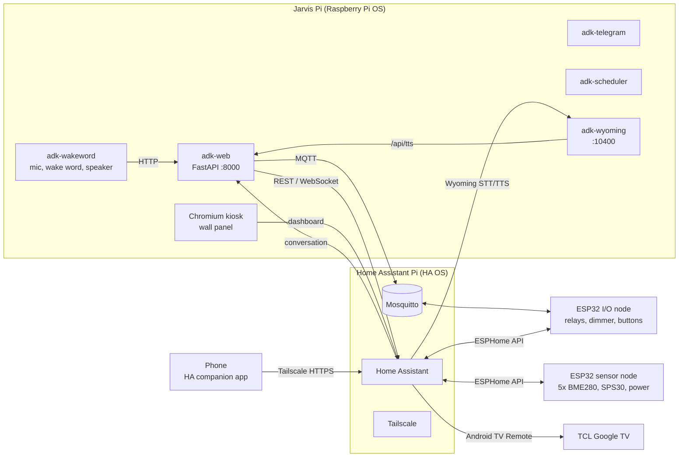
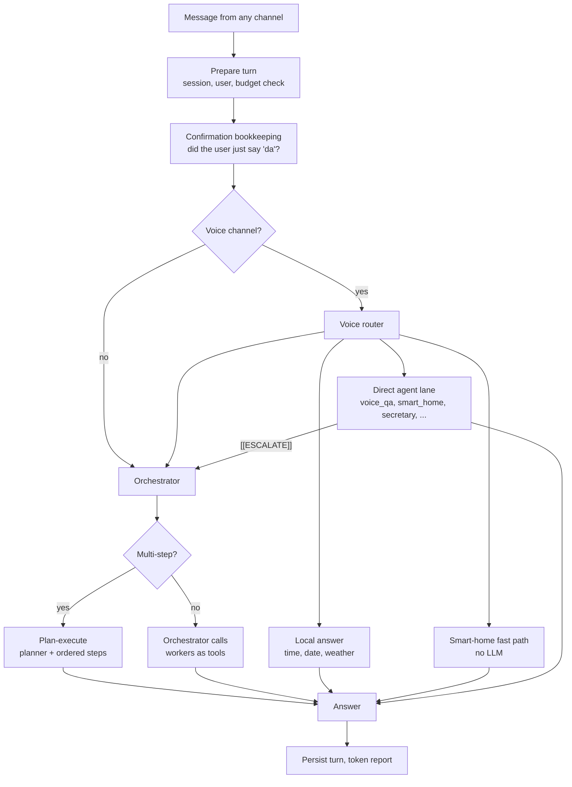

# Architecture

> 🇭🇷 [Hrvatska verzija](../hr/arhitektura.md)

Jarvis is a Croatian-speaking home assistant that runs on a Raspberry Pi 5. It
listens for a wake word, answers through Home Assistant on a phone or a wall
panel, and takes messages on Telegram and a web UI. Behind every channel sits
the same multi-agent system built on Google's Agent Development Kit (ADK), with
Claude as the reasoning model and Gemini where Google-only features are needed.

This page describes how the parts fit together. The voice path, Home Assistant
integration, hardware and deployment each have their own page.

---

## Two Raspberry Pis, one house



The **Home Assistant Pi** owns the devices: the MQTT broker, the ESPHome nodes,
the TV integration, dashboards, and remote access through Tailscale.

The **Jarvis Pi** owns the intelligence: five systemd services plus the wall
panel browser. It talks to devices in two ways — MQTT straight to the ESP32
relays (fast, deterministic) and Home Assistant's REST and WebSocket APIs for
everything else (TV, sensors, statistics, shopping list, notifications).

### The five services

| Unit | Entry point | What it does |
|------|-------------|--------------|
| `adk-web` | `run_web.py` | FastAPI on port 8000: chat API, streaming chat, TTS, web UI, status. Also publishes the Pi's own health to Home Assistant over MQTT. |
| `adk-wakeword` | `scripts/run_wakeword.py --wakeword` | Microphone loop: wake word, recording, speech-to-text, spoken answer. Sends each turn to `adk-web`. |
| `adk-telegram` | `scripts/telegram_bot.py` | Telegram bot (text, voice notes, photos), polling mode. |
| `adk-scheduler` | `run_scheduler.py --no-cli` | The only process that executes scheduled jobs. |
| `adk-wyoming` | `scripts/run_wyoming.py` | Wyoming protocol server that lends Home Assistant Assist Jarvis's speech recognition and voice. |

Each unit runs as an unprivileged user, restarts on failure, and — where it
matters — reports a systemd watchdog heartbeat, so a process that is alive but
no longer serving gets restarted instead of looking healthy
([why](engineering-notes.md#the-bot-that-was-dead-for-two-days-while-systemd-said-running)).

---

## One turn, every channel

Every channel — wake word, Home Assistant Assist, Telegram, web — enters through
`interfaces/base_interface.py`. A turn follows the same path regardless of where
it came from:



Sharing one path is a deliberate choice. Several bugs in this project's history
came from two channels doing the same thing in two places and drifting apart —
the web streaming endpoint once skipped the plan-execute path that `/api/chat`
used, and Home Assistant Assist once skipped the voice router entirely.

### The voice router

Spoken requests are classified before any model is called, in a fixed order.
Order matters: each rule exists because an earlier arrangement sent something to
the wrong place.

| # | Rule | Goes to | Why it sits here |
|---|------|---------|------------------|
| 1 | Time or date | local answer | 0.3 s, no model |
| 2 | "dnevni pregled" | daily briefing | before business keywords catch "što me čeka" |
| 3 | Pure meeting scheduling | `secretary` lane | multi-turn slot confirmation stays pinned |
| 4 | Mail, calendar, documents, tasks | orchestrator | needs tools and chaining |
| 5 | A command with a time ("sutra u 7 upali TV") | orchestrator → `scheduler` | a device lane would execute it *now* |
| 6 | Research or comparison | orchestrator | a question naming a device is not a command |
| 7 | A measurement about the house ("temperatura u kupaoni", "koliko smo jučer potrošili") | `smart_home` | "temperatura" is also a weather word, and the forecast used to answer it |
| 8 | Weather | local Open-Meteo lane | no agent has a weather tool |
| 9 | Philosophy, faith, home devices | `socrates`, `christian_guide`, `smart_home` | specialist lanes |
| 10 | Everything else | `voice_qa` | fast, tool-less; replies `[[ESCALATE]]` when it needs tools |

`voice_qa` runs on about 1,500 prompt tokens against the orchestrator's ~7,000,
so defaulting to it made ordinary questions several times cheaper and faster.
When it decides a request needs a tool, it answers with the sentinel
`[[ESCALATE]]`, and the interface re-runs the original message through the
orchestrator.

For home devices, `services/voice_fast_path.py` executes simple switch commands
("ugasi svjetlo u kuhinji") without any model call. It deliberately refuses
anything that looks like a question, a negation, a deferral, a compound request
("ugasi X, a stavi Y na 60 %") or a level change, and hands those to the
`smart_home` agent instead.

---

## Agents

On the Pi the `rpi-home` profile loads a curated set from
`config/agent_registry.py`:

| Agent | Role | Tools |
|-------|------|-------|
| `smart_orchestrator` | Coordinates workers; each worker is wrapped as a tool | the workers below |
| `voice_qa` | Fast spoken Q&A, escalates when tools are needed | none |
| `smart_home` | Lights, sockets, dimmer, scenes, TV, sensors and their history, shopping list, and everything else Home Assistant knows (read-only) | MQTT, Home Assistant |
| `secretary` | Google Calendar, free/busy, meeting slots | Calendar |
| `mailer` | Gmail | Gmail |
| `librarian` | Google Drive | Drive |
| `scribe` | Google Docs | Docs, Drive sharing |
| `analyst` | Google Sheets | Sheets |
| `rolodex` | Google Contacts | People API |
| `tracker` | Google Tasks | Tasks |
| `researcher` | Web research with search grounding, scraping, YouTube transcripts | research tools |
| `scraper` | Structured extraction from a URL | scraping |
| `synthesizer` | Turns research notes into a finished report | none |
| `scheduler` | Writes one-off and recurring jobs | job store |
| `socrates` | Socratic dialogue over a philosophy corpus | Vertex AI RAG |
| `christian_guide` | Christian reflection over a curated corpus | Vertex AI RAG |
| `ask_user` | Presents alternatives when a precondition fails | none |

Agents are built by one factory (`agents/adk_agents/adk_agent_factory.py`),
which is where the cross-cutting behaviour lives: model selection, prompt
caching, date injection, shared instruction fragments, tool logging, the tool
loop guard and the confirmation gate.

### Orchestration

For a single-worker request the orchestrator calls one worker as a tool and
summarises. For a chain ("istraži X, napravi dokument i pošalji Ani"), a
planner first decides whether the request needs several agents in sequence and
emits a strict JSON plan; `agents/adk_agents/plan_execute.py` then runs the
steps in order, pasting each step's result into the steps that depend on it.
Research that becomes a document goes through `synthesizer` before `scribe`.

---

## Models

| Where | Model | Why |
|-------|-------|-----|
| All reasoning agents | Claude Sonnet 5 via LiteLLM | best Croatian and tool use in this system |
| `socrates`, `christian_guide` | Gemini 2.5 Pro | Vertex AI RAG corpora are Gemini-only |
| `scraper` | Gemini 2.5 Flash | pinned by configuration |
| Speech-to-text | Gemini Transcribe (Chirp 2 fallback) | measured best Croatian, see [voice](voice-pipeline.md) |
| Text-to-speech | OpenAI `gpt-4o-mini-tts`, voice `cedar` | Cloud TTS Chirp 3 HD as fallback |

Selection is per agent and fully configurable; see
[LLMs and cost](llm-and-cost.md).

---

## Safety and reliability

A model that controls a house and sends mail needs guard rails that do not
depend on the model agreeing to them.

**Confirmation gate** (`services/approval_gate.py`). Mail to an address the
house has never written to, sharing a document with "anyone", and deleting a
calendar entry are held in code. The tool does not run; the model receives a
question to relay instead, and only the user's *next* message can arm the exact
action — the fingerprint covers recipients, subject, body, attachment contents
and linked documents, so "yes" to one mail does not approve a different one.
Held three times in one turn, it becomes a hard stop. In a scheduled job, with
nobody to ask, it refuses outright.

**Device confirmation** (`services/mqtt_confirm.py`). A switch command waits for
the device's state echo. A retained message that already matched is reported as
"already in that state", never as "done", and a device that does not answer is
reported as a failure — out loud, even in the terse voice mode.

**Tool loop guard.** Three identical failing tool calls short-circuit, six abort
the run. Voice turns have a real timeout that cancels the run and says so.

**Budget.** A daily ceiling on estimated LLM spend (`services/budget.py`).

**Process liveness** (`utils/process_guard.py`). Fatal errors exit hard, so a
non-daemon logging thread cannot keep a dead process alive; long-running
services feed the systemd watchdog.

**Boot race.** MQTT clients connect asynchronously and keep retrying, because
the Pi boots faster than the broker on the other Pi.

---

## State

| What | Where |
|------|-------|
| Chat history | Firestore |
| ADK sessions | memory (per process) |
| Learned TV apps and channels | `config/tv_apps.json`, `config/tv_channels.json` |
| Addresses the house has mailed | `data/known_recipients.json` |
| Scheduled jobs | `config/scheduled_jobs.<profile>.json`, shared by all processes, executed only by `adk-scheduler` |
| Daily spend | `data/llm_budget.json` |

The scheduler rule is strict: exactly one process executes jobs. The Telegram
and voice processes only write to the job store; the scheduler adopts new jobs
within 30 seconds and delivers results to the chat that asked.

---

## Repository map

```
agents/            prompts (instructions.md per agent) and ADK agent factories
config/            agent registry, deployment profiles, runtime patches
interfaces/        the shared turn path and one interface per channel
services/          voice router, fast path, approval gate, MQTT, Wyoming, STT
tools/             ADK tools: Google Workspace, Home Assistant, MQTT, research
web/               FastAPI app and the web UI
scripts/           service entry points, probes, corpus ingestion, backups
deploy/rpi/        systemd units, setup and audio scripts, kiosk panel
deploy/home_assistant/   custom integration, dashboard builder, themes, JS cards
deploy/tv_app_launcher/  tiny Android TV app that lets Jarvis open any app
esphome/           ESP32 sensor node configuration and the power component
tests/unit/        1,486 tests, no network or credentials needed
```
