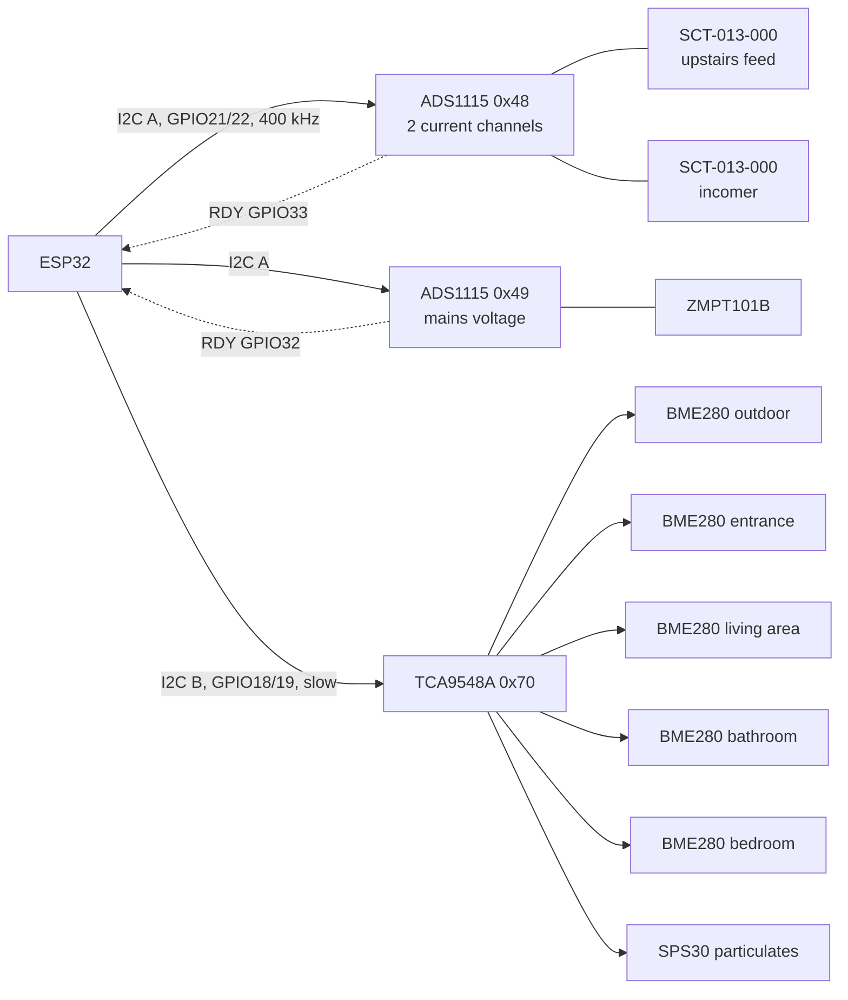

# Hardware

> 🇭🇷 [Hrvatska verzija](../hr/hardver.md)

Everything runs on hardware in the house. No cloud VM, no hub subscription.

| Device | Role |
|--------|------|
| Raspberry Pi 5 — **Jarvis** | agents, voice, API, wall panel display |
| WM8960 audio HAT | microphone and speaker for the wake-word loop |
| Touch display on the Jarvis Pi | wall panel (Chromium kiosk) |
| Raspberry Pi 5 — **Home Assistant** | Home Assistant OS, MQTT broker, ESPHome |
| ESP32 — **I/O node** | relays for lights, sockets and boiler; dimmer; wall push-buttons |
| ESP32 — **sensor node** | five BME280 climate sensors, SPS30 air quality, power measurement |
| TCL Google TV | controlled through Home Assistant |

All four network devices use static addresses configured **on the devices
themselves**, not DHCP reservations — which is why reservations on the router
never appeared to take effect.

---

## Jarvis Pi audio

The WM8960 powers up with its output mixers routed off and a capture gain that
makes speech unrecognisable. `deploy/rpi/setup_audio.sh` sets a known-good
mixer. Two details cost real debugging time:

- The raw card rejects the 24 kHz TTS audio, so playback uses ALSA's `default`
  device, whose plug layer resamples.
- Capture at ~50 % with no input boost gives clean transcripts. Full boost clips
  and the recogniser returns nothing; too little and it mishears.

The amplifier also powers down when idle and swallows the first word of the next
sentence, which is why the microphone opens with a short spoken cue.

---

## ESP32 sensor node (`esphome/bme280-mux-node.yaml`)

**Two I²C buses, on purpose.** The power ADCs sample continuously at 860 SPS
and need a fast, quiet bus. The climate sensors hang off 5–10 m cable runs,
which exceed I²C's capacitance budget at speed, so they get a separate slow bus
with strong pull-ups and twisted pairs carrying a ground next to each signal.
Measured before the split: the SPS30 does not answer at 400 kHz at all, and at
100 kHz a shared bus lost 7 % of power samples.

**Five identical sensors behind a multiplexer.** Every BME280 has address
`0x76`, so each sits on its own TCA9548A channel. Swapping two cables would make
the rooms silently trade names — no firmware can notice — so the cables are
labelled and the pinout records which channel is which room.

### Power measurement: the `phase_power` component

`esphome/components/phase_power/` is a custom ESPHome component in C++. It
pairs current and voltage samples from two ADS1115 chips, driven by their
ALERT/RDY interrupts, interpolates the voltage to each current sample's instant,
and computes RMS voltage and current, real and apparent power, and power factor
per channel. The two current channels alternate on one ADC in synchronised
batches.

- The incomer clamp measures the whole house, the second clamp the upstairs
  feed; the ground floor is published as the difference of **real power only**
  — RMS current and apparent power are not additive across feeds.
- Energy totals also integrate on the ESP32 itself, so a Wi-Fi drop or a
  reflash does not leave a hole in the day.

Two lessons from commissioning it:

- **A floating pin reads half.** For a day the upstairs channel read exactly
  half of every load step (56 steps, ratio 2.00, no phase difference). New
  clamps changed nothing. The channel was measured against an ADC input that
  had no wire; switching the multiplexer to the input that actually carries the
  bias voltage fixed it. A calibration factor of 2 would have frozen the wiring
  fault into a constant.
- **Phase correction, from the meter.** Against the utility meter the house read
  6 % low overnight. Fifty-six resistive load steps (boiler, kettle) showed
  reactive power where there should be none — an apparent angle of ~7.4° —
  and re-integrating the night with a smaller angle closed the gap. The voltage
  lag correction moved from −1280 to −1690 µs.

Detailed wiring and the design notebook, in Croatian:

- [`esphome/PINOUT.md`](../../esphome/PINOUT.md) — as-built pinout, verified on
  the device.
- [`esphome/HARDVER-mjerenje-snage.md`](../../esphome/HARDVER-mjerenje-snage.md)
  — the power-measurement design and the reasoning behind each choice. Parts of
  it are a plan that was later revised (the burden resistor stayed at 47 Ω; a
  third ADC was not fitted); `PINOUT.md` and the YAML are authoritative.

### Sensor faults found in software

- Two BME280s on the longest runs intermittently returned their power-on
  register values — always the same two numbers per sensor (188.5 °C and
  −57.6 °C, humidity exactly 0 % or 100 %). Range filters now drop them on the
  ESP32, and the history tool drops them again on read.
- The SPS30's particulate floor climbed from single digits to thousands within
  days. A fan-cleaning cycle changed nothing. Rather than open a welded optical
  sensor, the recommendation was to measure the 5 V supply at the far end of the
  cable first, since a sagging supply slows the fan and inflates counts exactly
  like this.

---

## ESP32 I/O node (`esphome/esp32-io.yaml`)

The switchboard of the house: three MCP23017 I/O expanders on one I²C bus.

| Expander | Address | Carries |
|----------|---------|---------|
| `mcp_lights` | `0x20` | 15 light relays and one spare |
| `mcp_outlets` | `0x22` | 14 socket relays (including the boiler, the oven and two spares) and two PIR inputs |
| `mcp_buttons` | `0x27` | 16 wall push-buttons |

The armchair light is dimmed by PWM straight from GPIO13.

Home Assistant talks to the node over the encrypted native ESPHome API; Jarvis
talks to it over MQTT, with a birth and last-will message on
`esp32-io/status`. The two paths fail independently
([the incident](engineering-notes.md#three-days-of-u-redu-to-a-device-that-was-not-there)).

Logic that lives on the ESP32, so it keeps working when every Pi is off:

- **Push-buttons.** A short press toggles the light. Holding any button for 5 s
  turns every light off. A double click on the armchair button steps its
  brightness through 25, 50, 75 and 100 %.
- **Bathroom–boiler interlock with memory.** Switching the bathroom light on
  remembers whether the boiler was on and switches it off. Switching the light
  off brings the boiler back only if it was on before. The boiler also refuses
  to switch on while the bathroom light is on.
- **Motion lights with manual override.** Outside and at the entrance a PIR
  switches the light on for 60 s or 30 s. A light switched on by hand is left
  alone when the timer runs out. (The PIR inputs ship disabled.)
- **Safe power-up.** Every relay comes back off after a power cut.

Diagnostics added after the three-day MQTT outage, so a reboot can be told
apart from a lost connection: Wi-Fi signal, uptime, chip temperature, free
memory, loop time, IP address and the reason for the last reset, plus restart
and safe-mode buttons.

All credentials (Wi-Fi, API encryption key, MQTT, OTA, web server) come from
ESPHome's `secrets.yaml`, which is not in the repository.
