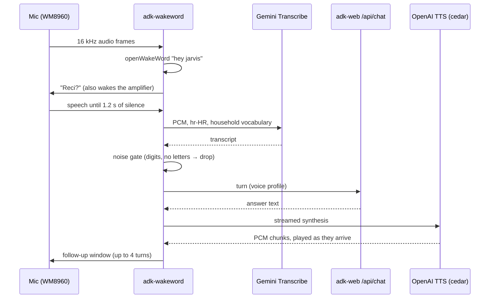

# Voice pipeline

> 🇭🇷 [Hrvatska verzija](../hr/glasovni-put.md)

Jarvis is spoken to in two ways: through the microphone on its own Pi, and
through Home Assistant Assist on a phone or the wall panel. Both end in the same
agents and the same voice. This page follows a spoken request from sound to
sound and records the measurements behind each choice.

---

## On the Pi: from wake word to answer



### Wake word

[openWakeWord](https://github.com/dscripka/openWakeWord) with the bundled
`hey_jarvis` model — free, offline, no access key. Porcupine remains available
behind `WAKEWORD_ENGINE=porcupine`.

The tuned values come from a bad night. With a threshold of 0.40, two
consecutive frames required and Silero VAD at 0.5, the assistant ignored six
attempts in a row. The VAD was the culprit: a quiet speaker peaks at only
3,000–7,000 of 32,768 at the chosen capture gain, Silero classified that as
non-speech, and every wake-word score was clamped to zero. The working
configuration is threshold 0.32, one frame, VAD off. Real detections afterwards
scored 0.44, 0.78 and 0.36 — two of the three would have missed the old
threshold. The false wakes VAD was meant to stop are caught later instead, by a
noise gate that throws away transcripts with no letters (a washing machine once
produced "Zbroj tih brojeva je 41").

The microphone is **opt-in**. Home Assistant has a switch that opens and closes
the capture device, and it turns itself off after 30 idle minutes. An always-on
room mic once turned music from a nearby speaker into two days of unnoticed
agent turns — and the API bill that came with them.

### Speech to text: measured, not assumed

Croatian is where most speech engines quietly fail, so candidates were measured
on the Pi with the same eight Croatian utterances, clean at 24 kHz and in a
16 kHz noisy variant that mimics what Home Assistant sends.

| Engine | WER | Latency |
|--------|-----|---------|
| Cloud Speech `chirp_2` | 18.9 % | 2.48 s |
| Gemini Transcribe, default | 14.4 % | 3.68 s |
| **Gemini Transcribe, `smart`** | **13.1 %** | **3.17 s** |
| Gemini Transcribe, `verbatim` | 12.0 % | 3.40 s |

WER overstates every engine (all of them normalise "dvadeset dva stupnja" to
"22 stupnja"). What decided it were the semantic errors: Chirp heard
"najvišja **vojna** temperatura" for "najviša **vanjska** temperatura" and
"Koja **nije**" for "Koja mi je". Gemini read both correctly. The price is about
0.7 s.

Two engines were rejected outright:

- **OpenAI `gpt-4o-transcribe`** writes ekavian Croatian ("svetlo" for
  "svjetlo"), garbles unclear audio, and once transcribed Croatian as
  Macedonian Cyrillic.
- **xAI** speech-to-text returned a round-trip of its own Croatian speech as
  **Czech**, and silently ignored an explicit `language=hr`. (Its Croatian
  *voice*, on the other hand, sounded natural.)

Gemini Transcribe is not served on Vertex AI and needs a Developer API key with
AI Studio credit — a separate billing pot from Google Cloud. The bundled SDK
spoke an older Interactions schema, so `services/audio/stt_service.py` calls the
REST endpoint directly. Chirp stays wired in as the automatic fallback.

### Text to speech

OpenAI `gpt-4o-mini-tts` with the `cedar` voice and built-in Croatian delivery
instructions. Playback is **streamed**: the wake-word loop plays PCM chunks as
they arrive, so the first sound comes after ~0.5 s instead of ~1.4 s. If OpenAI
fails, Google Cloud TTS (`hr-HR-Chirp3-HD-Charon`) takes over. Emoji are
stripped before synthesis.

On the WM8960 HAT the raw device rejects 24 kHz, so output goes through ALSA's
`default` plug device; `deploy/rpi/setup_audio.sh` sets the mixer, including a
capture gain that neither clips (empty transcripts) nor mishears.

### What the user hears

`VOICE_SMART_HOME_RESPONSE_MODE=ok` shortens device replies to "U redu." — and
that phrase is reserved for a **verified** change. When an ESP32 silently
dropped off MQTT for three days, the old code still said "U redu." for every
command, because a retained message matched the requested state
([story](engineering-notes.md#three-days-of-u-redu-to-a-device-that-was-not-there)).
Failures are always spoken.

---

## Through Home Assistant Assist

The phone and the wall panel use Home Assistant's own voice pipeline. Jarvis
plugs into all three of its stages:

```
mic → HA Assist → stt.jarvis_stt       → Wyoming → Gemini Transcribe on the Jarvis Pi
                → conversation.jarvis  → POST /api/chat → agents and tools
                → tts.jarvis_tts       → Wyoming → /api/tts → OpenAI cedar
                → speaker
```

**Wyoming bridge** (`services/wyoming_bridge.py`). One server advertises both
speech-to-text and text-to-speech, so Home Assistant needs one integration entry
and the Pi one unit. Failure is designed not to hang the dialog: a transcription
error returns an empty transcript (Assist says it did not understand), a
synthesis error still sends the audio start/stop pair (Assist stops waiting),
and audio under half a second never reaches the recogniser.

**Conversation integration** (`deploy/home_assistant/custom_components/jarvis`).
Home Assistant cannot point Assist at an arbitrary HTTP service — its built-in
OpenAI, Anthropic and Google agents would each be a *different* assistant
without Jarvis's tools — so a small custom integration forwards the utterance to
`/api/chat`.

Three problems had to be solved on the Home Assistant side:

1. **It cut people off mid-sentence.** Assist ends a turn after 0.7 s of silence
   and caps it at 15 s, and neither is configurable for the companion app. The
   integration moves those defaults to 3 s and 30 s at load time — located by
   name, verified, restored on unload, and skipped with a warning if Home
   Assistant's internals ever change. Verified live: a 2.5 s pause now survives,
   a 3.5 s pause still ends the turn, 30 s of speech arrives whole.
2. **Closing the dialog lost the thread and the answer.** Every reopened dialog
   gets a new conversation id. Within 10 minutes the integration now continues
   the previous Jarvis session, and every turn is stored in
   `sensor.jarvis_razgovor`, which survives restarts and feeds a transcript view
   on the dashboard.
3. **Slow answers died with the phone screen.** A 3½-minute research task
   finished successfully with nobody left to hear it. Past 25 seconds the turn
   now says the work continues, the run is shielded from the timeout, and the
   finished answer arrives as a phone notification (or is read aloud by the
   companion app). Verified: acknowledgement at 38.9 s, answer delivered 35 s
   later.

---

## Latency, end to end

| Request | Path | Time |
|---------|------|------|
| "Koliko je sati?" | local answer | 0.3 s |
| "Kakvo je vrijeme?" | weather lane | 0.7 s |
| Speech-to-text through Home Assistant | Wyoming → Gemini | 4.1 s including HA overhead |
| First audio of an answer | streamed TTS | ~0.5 s after text |

---

## Configuration

The relevant variables are grouped under *Voice* and *Wake word* in
[`.env.example`](../../.env.example). Probes for trying engines without the full
stack live in `scripts/` (`cloud_stt_probe.py`, `cloud_tts_probe.py`,
`openai_voice_probe.py`, `xai_voice_probe.py`).
