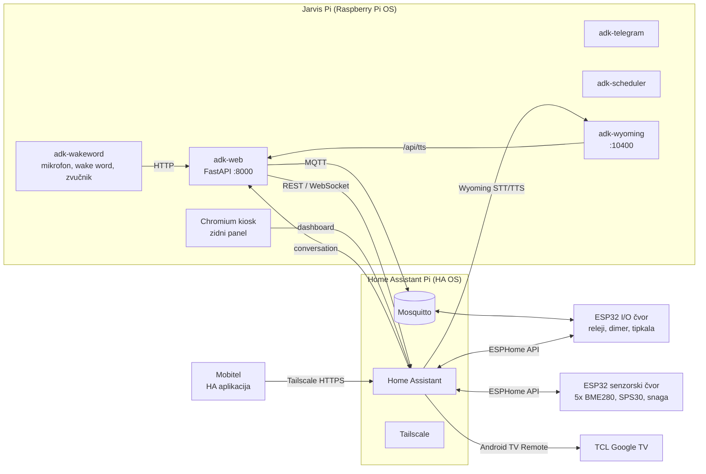
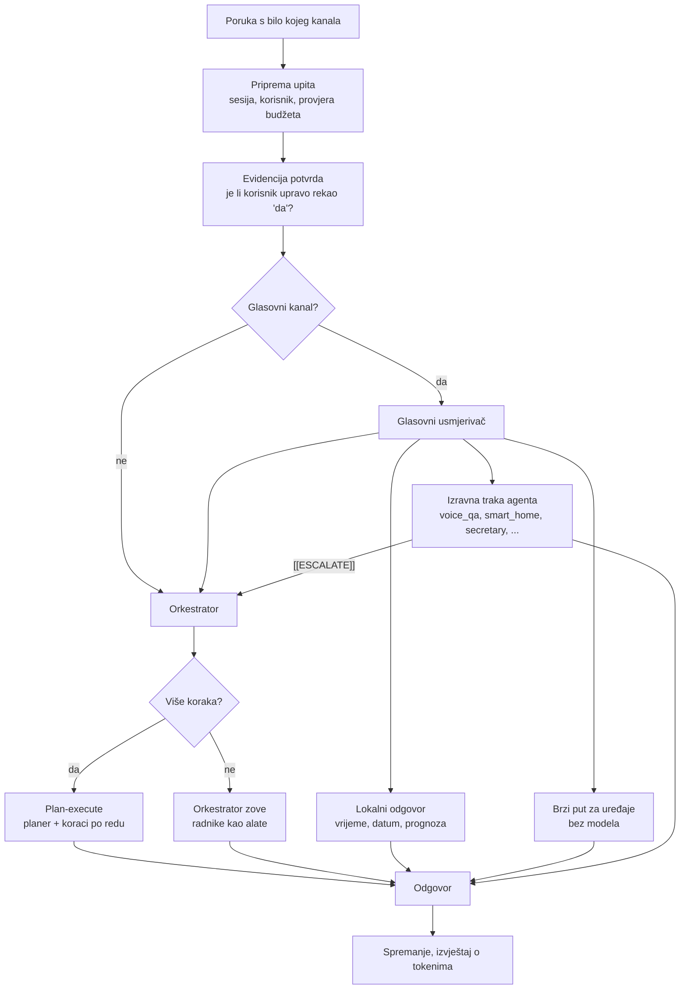

# Arhitektura

> 🇬🇧 [English version](../en/architecture.md)

Jarvis je kućni asistent koji govori hrvatski i radi na Raspberry Pi 5
računalu. Sluša wake word, odgovara kroz Home Assistant na mobitelu ili zidnom
panelu i prima poruke na Telegramu i u web sučelju. Iza svih kanala stoji isti
višeagentski sustav na Googleovu Agent Development Kitu (ADK). Rasuđuje Claude,
a Gemini se koristi gdje trebaju značajke dostupne samo kod Googlea.

Ova stranica opisuje kako se dijelovi uklapaju. Glasovni put, integracija s Home
Assistantom, hardver i postavljanje imaju svoje stranice.

---

## Dva Raspberry Pija, jedna kuća



**Home Assistant Pi** drži uređaje: MQTT broker, ESPHome čvorove, integraciju
televizora, dashboarde i udaljeni pristup preko Tailscalea.

**Jarvis Pi** drži inteligenciju: pet systemd servisa i preglednik zidnog
panela. S uređajima razgovara na dva načina:
- **MQTT-om izravno prema ESP32 relejima** (brzo, determinističko);
- **REST i WebSocket API-jem Home Assistanta** za sve ostalo (TV, senzori,
  statistika, popis za kupovinu, obavijesti).

### Pet servisa

| Jedinica | Ulazna točka | Što radi |
|----------|--------------|----------|
| `adk-web` | `run_web.py` | FastAPI na portu 8000: chat API, strujanje odgovora, TTS, web sučelje, status. Usput preko MQTT-a javlja Home Assistantu stanje samog Pija. |
| `adk-wakeword` | `scripts/run_wakeword.py --wakeword` | Petlja mikrofona: wake word, snimanje, pretvaranje govora u tekst, izgovoreni odgovor. Svaki upit šalje `adk-web` servisu. |
| `adk-telegram` | `scripts/telegram_bot.py` | Telegram bot (tekst, glasovne poruke, fotografije), u polling načinu. |
| `adk-scheduler` | `run_scheduler.py --no-cli` | Jedini proces koji izvršava zakazane poslove. |
| `adk-wyoming` | `scripts/run_wyoming.py` | Wyoming server koji Home Assistant Assistu posuđuje Jarvisovo prepoznavanje govora i glas. |

Svaka jedinica radi kao korisnik bez posebnih ovlasti i ponovno se pokreće nakon
pada. Gdje je važno, javlja systemd watchdogu da je živa. Tako se proces koji
postoji, ali više ne radi, restarta umjesto da izgleda zdravo
([zašto](inzenjerske-biljeske.md#bot-koji-je-dva-dana-bio-mrtav-dok-je-systemd-javljao-da-radi)).

---

## Jedan upit, svi kanali

Svaki kanal ulazi kroz `interfaces/base_interface.py`: wake word, Home Assistant
Assist, Telegram i web. Upit prolazi isti put bez obzira na to odakle je došao:



Jedan zajednički put je namjerna odluka. Nekoliko grešaka u povijesti projekta
nastalo je kad su dva kanala istu stvar radila na dva mjesta pa su se razišla:
- web endpoint za strujanje preskakao je plan-execute put koji je `/api/chat`
  koristio;
- Home Assistant Assist jednom je potpuno zaobilazio glasovni usmjerivač.

### Glasovni usmjerivač

Izgovoreni zahtjevi razvrstavaju se prije ikakvog poziva modelu, fiksnim
redoslijedom. Redoslijed je bitan: svako pravilo postoji zato što je raniji
raspored nešto slao na krivo mjesto.

| # | Pravilo | Ide na | Zašto baš ovdje |
|---|---------|--------|-----------------|
| 1 | Vrijeme ili datum | lokalni odgovor | 0,3 s, bez modela |
| 2 | „dnevni pregled" | dnevni pregled | prije poslovnih ključnih riječi koje bi uhvatile „što me čeka" |
| 3 | Čisto zakazivanje sastanka | traka `secretary` | višekoračna potvrda termina ostaje prikovana |
| 4 | Mail, kalendar, dokumenti, zadaci | orkestrator | trebaju alati i ulančavanje |
| 5 | Naredba s vremenom („sutra u 7 upali TV") | orkestrator → `scheduler` | traka za uređaje izvršila bi je *odmah* |
| 6 | Istraživanje ili usporedba | orkestrator | pitanje koje spominje uređaj nije naredba |
| 7 | Mjerenje u kući („temperatura u kupaoni", „koliko smo jučer potrošili") | `smart_home` | „temperatura" je i riječ za vrijeme, a nekad je na to odgovarala prognoza |
| 8 | Prognoza | lokalna Open-Meteo traka | nijedan agent nema alat za vrijeme |
| 9 | Filozofija, vjera, kućni uređaji | `socrates`, `christian_guide`, `smart_home` | specijalizirane trake |
| 10 | Sve ostalo | `voice_qa` | brz, bez alata; kad treba alat, vraća `[[ESCALATE]]` |

`voice_qa` troši oko 1.500 tokena prompta, a orkestrator oko 7.000. Zato je
obično pitanje uz njega nekoliko puta jeftinije i brže. Kad zaključi da zahtjevu
treba alat, odgovori oznakom `[[ESCALATE]]`, a sučelje izvornu poruku ponovno
provuče kroz orkestrator.

Za kućne uređaje `services/voice_fast_path.py` jednostavne naredbe paljenja i
gašenja („ugasi svjetlo u kuhinji") izvršava bez ikakvog modela. Namjerno odbija
sve što sliči na:
- pitanje;
- negaciju;
- odgodu;
- složeni zahtjev („ugasi X, a stavi Y na 60 %");
- promjenu razine.

Takve zahtjeve predaje agentu `smart_home`.

---

## Agenti

Na Piju profil `rpi-home` iz `config/agent_registry.py` učitava odabrani skup:

| Agent | Uloga | Alati |
|-------|-------|-------|
| `smart_orchestrator` | Koordinira radnike; svaki radnik je umotan kao alat | radnici ispod |
| `voice_qa` | Brza govorna pitanja, prosljeđuje dalje kad trebaju alati | nema |
| `smart_home` | Svjetla, utičnice, dimer, scene, TV, senzori i povijest, popis za kupovinu i sve ostalo što Home Assistant zna (samo čitanje) | MQTT, Home Assistant |
| `secretary` | Google Kalendar, slobodni termini, sastanci | Calendar |
| `mailer` | Gmail | Gmail |
| `librarian` | Google Drive | Drive |
| `scribe` | Google Docs | Docs, dijeljenje na Driveu |
| `analyst` | Google Sheets | Sheets |
| `rolodex` | Google kontakti | People API |
| `tracker` | Google Tasks | Tasks |
| `researcher` | Istraživanje weba uz search grounding, scraping, YouTube transkripti | alati za istraživanje |
| `scraper` | Strukturirano izvlačenje s URL-a | scraping |
| `synthesizer` | Bilješke iz istraživanja pretvara u dovršen izvještaj | nema |
| `scheduler` | Zapisuje jednokratne i ponavljajuće poslove | spremište poslova |
| `socrates` | Sokratski dijalog nad korpusom filozofije | Vertex AI RAG |
| `christian_guide` | Kršćansko promišljanje nad odabranim korpusom | Vertex AI RAG |
| `ask_user` | Nudi alternative kad preduvjet nije ispunjen | nema |

Agente gradi jedna tvornica (`agents/adk_agents/adk_agent_factory.py`). Tamo živi
ponašanje zajedničko svima:
- izbor modela;
- predmemorija promptova;
- ubacivanje datuma;
- zajednički dijelovi uputa;
- zapisivanje poziva alata;
- zaštita od petlje alata;
- vrata potvrde.

### Orkestracija

Kad zahtjevu treba jedan radnik, orkestrator ga pozove kao alat i sažme
rezultat. Kad treba lanac („istraži X, napravi dokument i pošalji Ani"):
1. Planer odluči treba li više agenata redom i ispiše strogi JSON plan.
2. `agents/adk_agents/plan_execute.py` izvrši korake po redu i rezultat svakog
   koraka umetne u korake koji o njemu ovise.

Istraživanje koje postaje dokument ide kroz `synthesizer` prije nego stigne do
`scribe`.

---

## Modeli

| Gdje | Model | Zašto |
|------|-------|-------|
| Svi agenti koji rasuđuju | Claude Sonnet 5 preko LiteLLM-a | najbolji hrvatski i korištenje alata u ovom sustavu |
| `socrates`, `christian_guide` | Gemini 2.5 Pro | Vertex AI RAG korpusi rade samo s Geminijem |
| `scraper` | Gemini 2.5 Flash | prikovan konfiguracijom |
| Govor u tekst | Gemini Transcribe (Chirp 2 kao rezerva) | izmjereno najbolji hrvatski, vidi [glasovni put](glasovni-put.md) |
| Tekst u govor | OpenAI `gpt-4o-mini-tts`, glas `cedar` | Cloud TTS Chirp 3 HD kao rezerva |

Izbor je po agentu i potpuno podesiv; vidi [Modeli i trošak](modeli-i-trosak.md).

---

## Sigurnost i pouzdanost

Model koji upravlja kućom i šalje mailove treba zaštite koje ne ovise o tome
hoće li ih se model pridržavati.

**Vrata potvrde** (`services/approval_gate.py`). Kod zadržava tri vrste radnji:
- mail na adresu na koju kuća nikad nije pisala;
- dijeljenje dokumenta sa „svima";
- brisanje termina u kalendaru.

Alat se tada ne izvrši, nego model dobije pitanje koje treba prenijeti. Samo
korisnikova *sljedeća* poruka može odobriti točno tu radnju. Otisak radnje
pokriva primatelje, naslov, tekst, sadržaj privitka i povezane dokumente, pa
„da" za jedan mail ne odobrava drugi. Radnja zadržana triput u istom upitu
postaje tvrdo zaustavljanje. U zakazanom poslu, gdje nema koga pitati, odbija se
odmah.

**Potvrda uređaja** (`services/mqtt_confirm.py`). Naredba sklopki čeka da uređaj
vrati novo stanje. Postoje tri ishoda:
- zadržana poruka koja se već poklapala javlja se kao „već je u tom stanju",
  nikad kao „gotovo";
- uređaj koji ne odgovori javlja se kao greška, naglas, čak i u kratkom
  glasovnom načinu;
- „gotovo" vrijedi samo uz stvarnu potvrdu stanja.

**Zaštita od petlje alata.** Tri jednaka neuspjela poziva prekidaju se, a šest
ruši cijelo izvršavanje. Glasovni upiti imaju stvarni timeout koji otkazuje
izvršavanje i to kaže.

**Budžet.** Dnevni limit procijenjene potrošnje na modele (`services/budget.py`).

**Živost procesa** (`utils/process_guard.py`). Kobne greške završavaju proces
tvrdo, pa ga pozadinska logging dretva ne može držati živim. Dugotrajni servisi
hrane systemd watchdog.

**Utrka pri pokretanju.** MQTT klijenti se spajaju asinkrono i pokušavaju
ponovno, jer se Pi pokrene brže od brokera na drugom Piju.

---

## Stanje

| Što | Gdje |
|-----|------|
| Povijest razgovora | Firestore |
| ADK sesije | memorija (po procesu) |
| Naučene TV aplikacije i kanali | `config/tv_apps.json`, `config/tv_channels.json` |
| Adrese na koje je kuća pisala | `data/known_recipients.json` |
| Zakazani poslovi | `config/scheduled_jobs.<profil>.json`, dijele ga svi procesi, izvršava samo `adk-scheduler` |
| Dnevna potrošnja | `data/llm_budget.json` |

Pravilo za raspored je strogo: poslove izvršava točno jedan proces. Telegram i
glasovni proces samo pišu u spremište poslova. Raspored nove poslove preuzme u
roku od 30 sekundi i rezultat isporuči u chat iz kojeg je posao zatražen.

---

## Struktura repozitorija

```
agents/            upute (instructions.md po agentu) i ADK tvornice agenata
config/            registar agenata, profili, runtime zakrpe
interfaces/        zajednički put poruke i po jedno sučelje za svaki kanal
services/          glasovni usmjerivač, brzi put, vrata potvrde, MQTT, Wyoming, STT
tools/             ADK alati: Google Workspace, Home Assistant, MQTT, istraživanje
web/               FastAPI aplikacija i web sučelje
scripts/           ulazne točke servisa, probe, unos korpusa, backup
deploy/rpi/        systemd jedinice, skripte za postavljanje i zvuk, zidni panel
deploy/home_assistant/   vlastita integracija, generator dashboarda, teme, JS kartice
deploy/tv_app_launcher/  mala Android TV aplikacija kojom Jarvis otvara bilo koju aplikaciju
esphome/           konfiguracija ESP32 senzorskog čvora i komponenta za snagu
tests/unit/        1.486 testova, bez mreže i vjerodajnica
```
