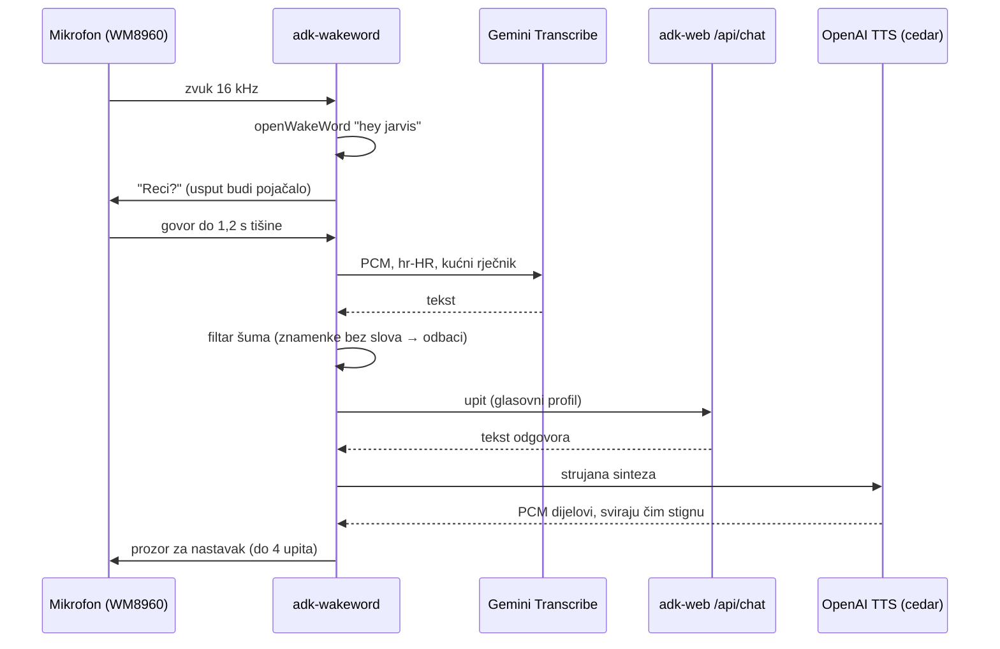

# Glasovni put

> 🇬🇧 [English version](../en/voice-pipeline.md)

Jarvisu se govori na dva načina: preko mikrofona na njegovu Piju i preko Home
Assistant Assista na mobitelu ili zidnom panelu. Oba završavaju kod istih agenata
i istog glasa. Ova stranica prati izgovoreni zahtjev od zvuka do zvuka i bilježi
mjerenja iza svake odluke.

---

## Na Piju: od wake worda do odgovora



### Wake word

[openWakeWord](https://github.com/dscripka/openWakeWord) s ugrađenim modelom
`hey_jarvis`: besplatan, radi bez interneta, ne treba ključ. Porcupine je i dalje
dostupan uz `WAKEWORD_ENGINE=porcupine`.

Podešene vrijednosti nastale su nakon loše noći. Uz prag 0,40, dva uzastopna
okvira i Silero VAD na 0,5, asistent je ignorirao šest pokušaja zaredom.

Krivac je bio VAD. Tih govornik pri odabranom pojačanju doseže samo 3.000–7.000
od 32.768. Silero je to proglasio negovorom, pa je svaki rezultat wake worda
spušten na nulu.

Radna postavka je prag 0,32, jedan okvir i isključen VAD. Stvarna prepoznavanja
nakon toga imala su 0,44, 0,78 i 0,36; dva od tri promašila bi stari prag.

Lažna buđenja koja je VAD trebao zaustaviti hvataju se kasnije. Filtar šuma
odbacuje prijepise bez slova (perilica je jednom proizvela „Zbroj tih brojeva je
41").

Mikrofon je **opt-in**. Home Assistant ima sklopku koja otvara i zatvara uređaj
za snimanje, a ona se sama gasi nakon 30 minuta neaktivnosti. Mikrofon koji je
stalno slušao jednom je glazbu sa zvučnika pretvorio u dva dana nezamijećenih
upita agentu. Uz to je stigao i račun za API.

### Govor u tekst: izmjereno, ne pretpostavljeno

Na hrvatskom većina mehanizama za prepoznavanje govora tiho zakaže. Zato su
kandidati izmjereni na Piju, na istih osam hrvatskih rečenica, u dvije inačice:
- čisto na 24 kHz;
- 16 kHz sa šumom, kao ono što šalje Home Assistant.

| Mehanizam | WER | Kašnjenje |
|-----------|-----|-----------|
| Cloud Speech `chirp_2` | 18,9 % | 2,48 s |
| Gemini Transcribe, zadano | 14,4 % | 3,68 s |
| **Gemini Transcribe, `smart`** | **13,1 %** | **3,17 s** |
| Gemini Transcribe, `verbatim` | 12,0 % | 3,40 s |

WER precjenjuje svaki mehanizam, jer svi „dvadeset dva stupnja" normaliziraju u
„22 stupnja". Odlučile su semantičke pogreške. Chirp je čuo:
- „najvišja **vojna** temperatura" umjesto „najviša **vanjska** temperatura";
- „Koja **nije**" umjesto „Koja mi je".

Gemini je obje pročitao ispravno. Cijena je oko 0,7 s.

Dva mehanizma su odbijena odmah:

- **OpenAI `gpt-4o-transcribe`** piše ekavicom („svetlo" umjesto „svjetlo"),
  kvari nejasan zvuk i jednom je hrvatski prepisao makedonskom ćirilicom.
- **xAI** je vlastiti hrvatski govor u povratnom testu prepisao kao **češki** i
  prešutno ignorirao izričit `language=hr`. Njegov hrvatski *glas* je, s druge
  strane, zvučao prirodno.

Gemini Transcribe nije dostupan na Vertex AI. Treba mu Developer API ključ s
AI Studio kreditom, a to je zaseban lonac od Google Clouda. Ugrađeni SDK govorio
je stariju shemu Interactions API-ja, pa `services/audio/stt_service.py` zove
REST izravno. Chirp ostaje spojen kao automatska rezerva.

### Tekst u govor

OpenAI `gpt-4o-mini-tts`, glas `cedar`, s ugrađenim uputama za hrvatski izgovor.
Reprodukcija je **strujana**: petlja svira PCM dijelove čim stignu, pa prvi zvuk
dolazi nakon ~0,5 s umjesto ~1,4 s. Ako OpenAI zakaže, preuzima Google Cloud TTS
(`hr-HR-Chirp3-HD-Charon`). Emoji se uklanjaju prije sinteze.

Sirovi uređaj WM8960 odbija 24 kHz, pa izlaz ide kroz ALSA-in `default` uređaj.
`deploy/rpi/setup_audio.sh` postavlja mikser, uključujući pojačanje snimanja
koje ni ne reže (prazni prijepisi) ni ne dovodi do krivog prepoznavanja.

### Što korisnik čuje

`VOICE_SMART_HOME_RESPONSE_MODE=ok` skraćuje odgovore uređaja na „U redu.", a ta
je fraza rezervirana za **potvrđenu** promjenu. ESP32 je jednom tri dana bio
tiho odspojen s MQTT-a, a stari kod je i dalje na svaku naredbu govorio
„U redu.". Zadržana poruka poklapala se s traženim stanjem
([priča](inzenjerske-biljeske.md#tri-dana-u-redu-uređaju-kojeg-nije-bilo)).
Greške se uvijek izgovaraju.

---

## Kroz Home Assistant Assist

Mobitel i zidni panel koriste Home Assistantov vlastiti glasovni cjevovod.
Jarvis se uključuje u sve tri njegove faze:

```
mikrofon → HA Assist → stt.jarvis_stt       → Wyoming → Gemini Transcribe na Jarvis Piju
                     → conversation.jarvis  → POST /api/chat → agenti i alati
                     → tts.jarvis_tts       → Wyoming → /api/tts → OpenAI cedar
                     → zvučnik
```

**Wyoming most** (`services/wyoming_bridge.py`). Jedan server nudi i
prepoznavanje i sintezu govora, pa Home Assistant treba jedan unos, a Pi jednu
jedinicu. Greške su dizajnirane tako da ne zamrznu dijalog:
- neuspjelo prepoznavanje vraća prazan tekst, pa Assist kaže da nije razumio;
- neuspjela sinteza ipak pošalje par početak/kraj zvuka, pa Assist prestane
  čekati;
- zvuk kraći od pola sekunde ne stiže do prepoznavanja.

**Integracija za razgovor**
(`deploy/home_assistant/custom_components/jarvis`). Home Assistant ne može
Assist uputiti na proizvoljni HTTP servis. Njegovi ugrađeni OpenAI, Anthropic i
Google agenti bili bi *drugi* asistent, bez Jarvisovih alata. Zato mala vlastita
integracija izgovoreno prosljeđuje na `/api/chat`.

Na strani Home Assistanta trebalo je riješiti tri problema:

1. **Rezao je rečenice na pola.** Assist završava upit nakon 0,7 s tišine i
   ograničava ga na 15 s, a nijedno se ne može podesiti za mobilnu aplikaciju.
   Integracija pri učitavanju te zadane vrijednosti pomiče na 3 s i 30 s. Traži
   ih po imenu, provjerava promjenu, vraća ih pri uklanjanju i ne dira ništa ako
   se Home Assistant iznutra promijeni. Provjereno uživo: pauza od 2,5 s sada
   prolazi, pauza od 3,5 s i dalje završava upit, a 30 s govora stigne cijelo.
2. **Zatvaranje prozora gubilo je nit i odgovor.** Svaki ponovno otvoren prozor
   dobiva novi id razgovora. Unutar 10 minuta integracija sada nastavlja
   prethodnu Jarvisovu sesiju. Svaki upit sprema se u `sensor.jarvis_razgovor`,
   koji preživi restart i hrani prikaz prijepisa na dashboardu.
3. **Spori odgovori umirali su s ekranom mobitela.** Istraživanje od tri i pol
   minute uspješno je završilo, a nije bilo nikoga da ga čuje. Nakon 25 sekundi
   upit sada kaže da se posao nastavlja, a izvršavanje je zaštićeno od timeouta.
   Gotov odgovor stiže kao obavijest na mobitel (ili ga aplikacija pročita
   naglas). Provjereno: potvrda nakon 38,9 s, odgovor isporučen 35 s kasnije.

---

## Kašnjenje od početka do kraja

| Zahtjev | Put | Vrijeme |
|---------|-----|---------|
| „Koliko je sati?" | lokalni odgovor | 0,3 s |
| „Kakvo je vrijeme?" | traka za prognozu | 0,7 s |
| Govor u tekst kroz Home Assistant | Wyoming → Gemini | 4,1 s uključujući HA |
| Prvi zvuk odgovora | strujani TTS | ~0,5 s nakon teksta |

---

## Postavke

Varijable su grupirane pod *Voice* i *Wake word* u
[`.env.example`](../../.env.example). Probe za isprobavanje mehanizama bez cijelog
sustava su u `scripts/`: `cloud_stt_probe.py`, `cloud_tts_probe.py`,
`openai_voice_probe.py` i `xai_voice_probe.py`.
