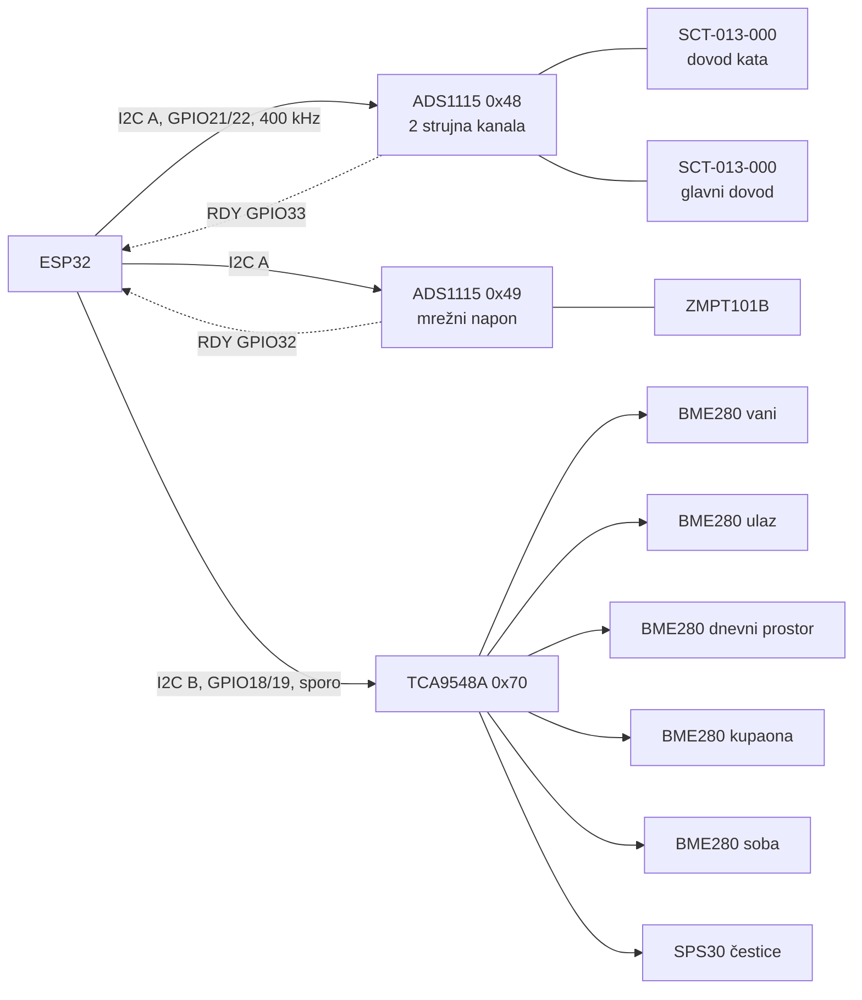

# Hardver

> 🇬🇧 [English version](../en/hardware.md)

Sve radi na hardveru u kući. Nema virtualnog stroja u oblaku ni pretplate na hub.

| Uređaj | Uloga |
|--------|-------|
| Raspberry Pi 5 — **Jarvis** | agenti, glas, API, zaslon zidnog panela |
| WM8960 audio HAT | mikrofon i zvučnik za petlju wake worda |
| Zaslon na dodir na Jarvis Piju | zidni panel (Chromium kiosk) |
| Raspberry Pi 5 — **Home Assistant** | Home Assistant OS, MQTT broker, ESPHome |
| ESP32 — **I/O čvor** | releji za svjetla, utičnice i bojler; dimer; zidna tipkala |
| ESP32 — **senzorski čvor** | pet BME280 senzora klime, SPS30 kvaliteta zraka, mjerenje snage |
| TCL Google TV | upravljanje kroz Home Assistant |

Sva četiri mrežna uređaja imaju statičke adrese postavljene **na samim
uređajima**, ne rezervacijom na routeru. Zato se činilo da rezervacije na routeru
nikad ne rade.

---

## Zvuk na Jarvis Piju

WM8960 se uključi s isključenim izlaznim mikserima i pojačanjem snimanja pri
kojem se govor ne može prepoznati. `deploy/rpi/setup_audio.sh` postavlja
provjeren mikser. Dva detalja koštala su stvarnog vremena:

- Sirova kartica odbija TTS zvuk od 24 kHz, pa reprodukcija ide kroz ALSA-in
  `default` uređaj, čiji plug sloj preuzorkuje.
- Snimanje na ~50 % bez pojačanja ulaza daje čiste prijepise. Puno pojačanje reže
  signal pa prepoznavanje ne vrati ništa; premalo i krivo čuje.

Pojačalo se u mirovanju gasi i proguta prvu riječ sljedeće rečenice. Zato se
mikrofon otvara kratkim izgovorenim znakom.

---

## ESP32 senzorski čvor (`esphome/bme280-mux-node.yaml`)

**Dvije I²C sabirnice, namjerno.**
- ADC-ovi za snagu uzorkuju kontinuirano na 860 SPS i trebaju brzu, mirnu
  sabirnicu.
- Senzori klime vise na kabelima od 5–10 m, koji pri brzini premašuju I²C
  kapacitet. Zato imaju zasebnu sporu sabirnicu s jakim pull-upovima i upredenim
  paricama s masom uz svaki signal.

Izmjereno prije razdvajanja: SPS30 na 400 kHz uopće ne odgovara, a na 100 kHz
zajednička sabirnica gubila je 7 % uzoraka snage.

**Pet jednakih senzora iza multipleksera.** Svaki BME280 ima adresu `0x76`, pa je
svaki na svom kanalu TCA9548A-a. Zamjena dva kabela tiho bi zamijenila imena
soba, a to nijedan firmware ne može primijetiti. Zato su kabeli označeni, a
pinout bilježi koji je kanal koja soba.

### Mjerenje snage: komponenta `phase_power`

`esphome/components/phase_power/` je vlastita ESPHome komponenta u C++-u.
- Uparuje uzorke struje i napona s dva ADS1115 čipa, vođena njihovim ALERT/RDY
  prekidima.
- Napon interpolira na trenutak svakog uzorka struje.
- Po kanalu računa efektivni napon i struju, radnu i prividnu snagu te faktor
  snage.
- Dva strujna kanala izmjenjuju se na jednom ADC-u u sinkroniziranim serijama.

Raspodjela mjerenja:
- Kliješta na glavnom dovodu mjere cijelu kuću, a druga kliješta dovod kata.
- Prizemlje se objavljuje kao razlika **samo radne snage**. Efektivna struja i
  prividna snaga ne zbrajaju se preko dovoda.
- Potrošnja se integrira i na samom ESP32, pa pad Wi-Fija ili ponovno flashanje
  ne ostavi rupu u danu.

Dvije pouke s puštanja u rad:

- **Nespojen pin čita pola.** Kanal kata je dan čitao točno pola svakog skoka
  potrošnje: 56 skokova, omjer 2,00, bez faznog pomaka. Nova kliješta nisu
  promijenila ništa. Kanal se mjerio prema ulazu ADC-a na kojem nije bilo žice.
  Prebacivanje multipleksera na ulaz koji stvarno nosi prednapon riješilo je
  problem. Kalibracijski faktor 2 zamrznuo bi grešku u ožičenju u konstantu.
- **Fazna korekcija, prema brojilu.** Prema brojilu elektrodistribucije kuća je
  preko noći čitala 6 % premalo. Pedeset šest otporskih skokova (bojler, kuhalo)
  pokazalo je jalovu snagu gdje je ne bi smjelo biti, prividni kut od ~7,4°.
  Ponovna integracija noći s manjim kutom zatvorila je razliku. Korekcija
  kašnjenja napona pomaknuta je s −1280 na −1690 µs.

Detaljno ožičenje i dnevnik dizajna:

- [`esphome/PINOUT.md`](../../esphome/PINOUT.md): stvarni raspored pinova,
  provjeren na uređaju.
- [`esphome/HARDVER-mjerenje-snage.md`](../../esphome/HARDVER-mjerenje-snage.md):
  dizajn mjerenja snage i obrazloženje svake odluke. Dijelovi su plan koji je
  kasnije izmijenjen: otpornik tereta ostao je 47 Ω, a treći ADC nije ugrađen.
  Mjerodavni su `PINOUT.md` i YAML.

### Kvarovi senzora pronađeni u softveru

- Dva BME280 na najdužim kabelima povremeno su vraćala vrijednosti registara pri
  uključenju, uvijek iste dvije po senzoru: 188,5 °C i −57,6 °C, vlaga točno 0 %
  ili 100 %. Filtri raspona ih sada odbacuju na ESP32, a alat za povijest još
  jednom pri čitanju.
- Donja granica čestica na SPS30 u nekoliko dana narasla je s jednoznamenkastih
  vrijednosti na tisuće. Ciklus čišćenja ventilatora nije promijenio ništa.
  Umjesto otvaranja zavarenog optičkog senzora preporuka je bila najprije
  izmjeriti napajanje od 5 V na kraju kabela. Oslabljeno napajanje usporava
  ventilator i napuhuje očitanja upravo ovako.

---

## ESP32 I/O čvor

Releji za 15 svjetala, 14 utičnica i bojler, dimer i 16 zidnih tipkala. Home
Assistant s njim razgovara nativnim ESPHome API-jem, a Jarvis preko MQTT-a. Zato
dva puta otkazuju neovisno jedan o drugom
([incident](inzenjerske-biljeske.md#tri-dana-u-redu-uređaju-kojeg-nije-bilo)).

> Njegova ESPHome konfiguracija još nije u ovom repozitoriju.
